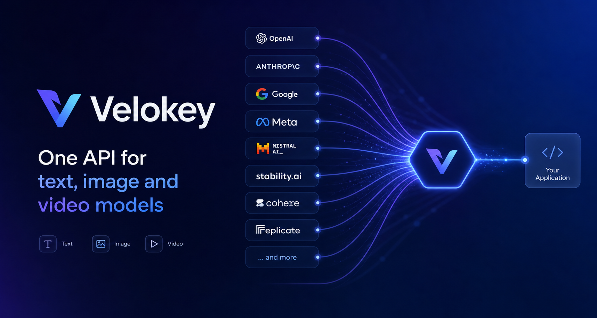

<!--
  Velokey 组织 Profile README。
  发布：在组织下建一个名为 `.github` 的 public 仓库，把本文件放到该仓库的 `profile/README.md`，
  并把 assets/header.png 一并放到 `profile/assets/header.png`。即会显示在组织主页顶部。
  上线前替换：Discord 邀请链接、X/Twitter handle、docs 真实域名（若非 docs.velokey.ai）。
-->

<div align="center">

<!-- 品牌横幅（gpt-image-2 生成） -->
<a href="https://velokey.ai?sourceChannel=github-profile" target="_blank" rel="noopener">
  
</a>

<br/><br/>

[](https://velokey.ai?sourceChannel=github-profile)
[](https://velokey.ai?sourceChannel=github-profile)
[](https://velokey.ai?sourceChannel=github-profile)
[](https://velokey.ai?sourceChannel=github-profile)

[](https://velokey.ai)
[](https://velokey.ai)
[](https://github.com/velokey)
[](https://github.com/velokey)

**Access leading text, image, and video models through one OpenAI‑compatible API.**
<br/>Switch models without rebuilding integrations. Pay only for what you use.

</div>

---

## 🌐 One endpoint, every modality

| Category | Models |
| :--- | :--- |
| **🔤 Text** |       |
| **🖼️ Image** |      |
| **🎬 Video** |       |

<div align="center">

[](https://velokey.ai?sourceChannel=github-profile)

</div>

---

## ⚡ Quickstart — keep your OpenAI SDK

Already using an OpenAI‑compatible client? Migration is a **Base URL + API key** change.

```python
from openai import OpenAI

client = OpenAI(
    api_key="YOUR_VELOKEY_API_KEY",
    base_url="https://api.velokey.ai/v1",
)

response = client.chat.completions.create(
    model="claude-opus-4-8",  # or gpt-5.5, gemini-3-pro, deepseek-v4 …
    messages=[{"role": "user", "content": "Hello from Velokey!"}],
)
print(response.choices[0].message.content)
```

<div align="center">

[](https://velokey.ai?sourceChannel=github-profile)
[](https://velokey.ai?sourceChannel=github-profile)

</div>

---

## 💡 Why Velokey

- **🔌 One API across providers** — one familiar, OpenAI‑compatible format for text, image, and video. Add or switch models without rebuilding your stack.
- **🎛 Choose by capability and price** — compare capabilities, billing units, and pricing *before* you integrate.
- **🛡 Reliable by design** — route‑health monitoring and **automatic failover** to healthy routes, with usage, latency, errors, and spend in one console.
- **💸 Pay as you go** — token‑based for LLMs, per‑image and per‑second for media. Transparent pricing, no lock‑in.
- **🔒 Private by default** — we don't retain prompt or model‑output content, and never train on your API data.

---

<div align="center">

<sub>One key. Text, image & video models. OpenAI‑compatible. · <a href="https://velokey.ai?sourceChannel=github-profile">velokey.ai</a> · <a href="mailto:support@velokey.ai">support@velokey.ai</a></sub>

<br/><sub>Built for developers worldwide · © 2026 Velokey</sub>

</div>
